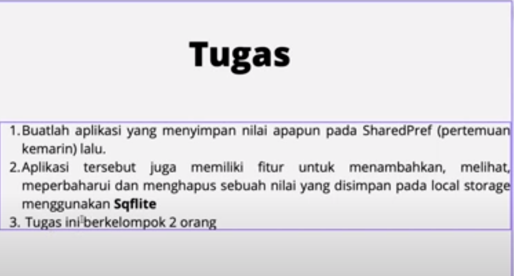
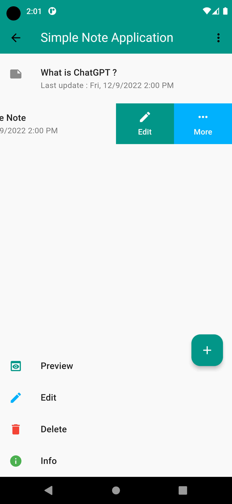
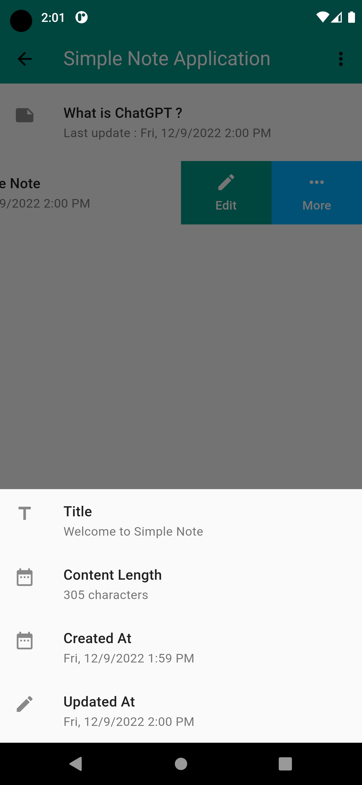
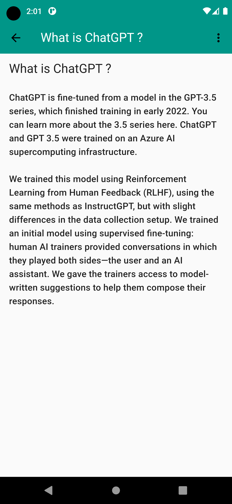
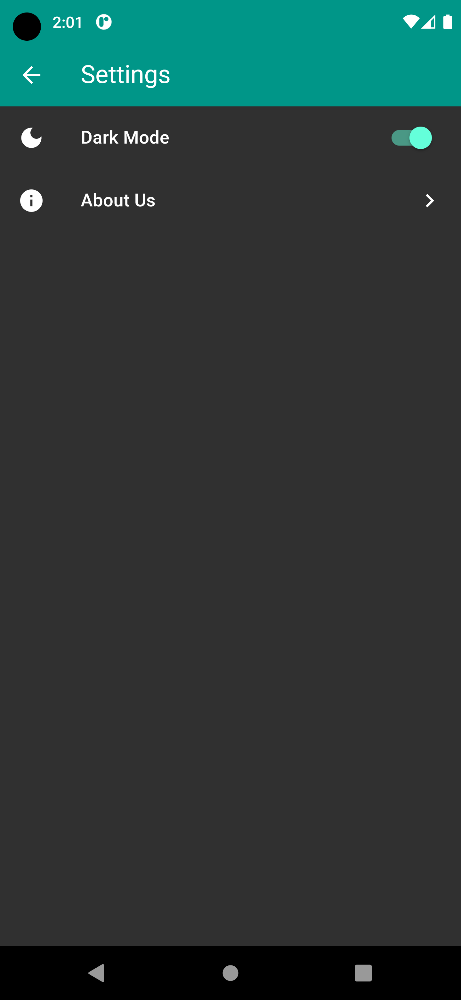
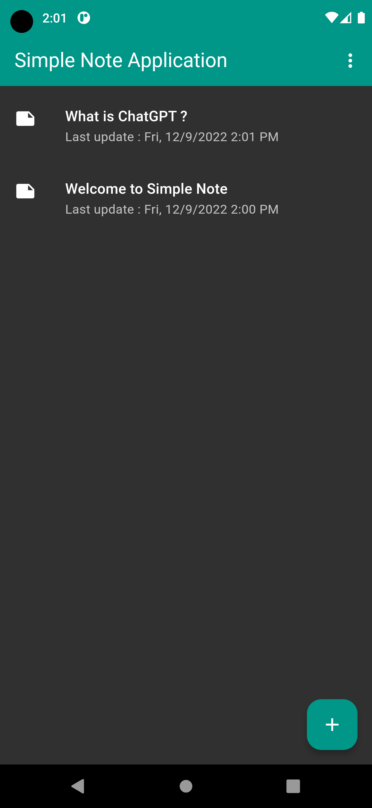
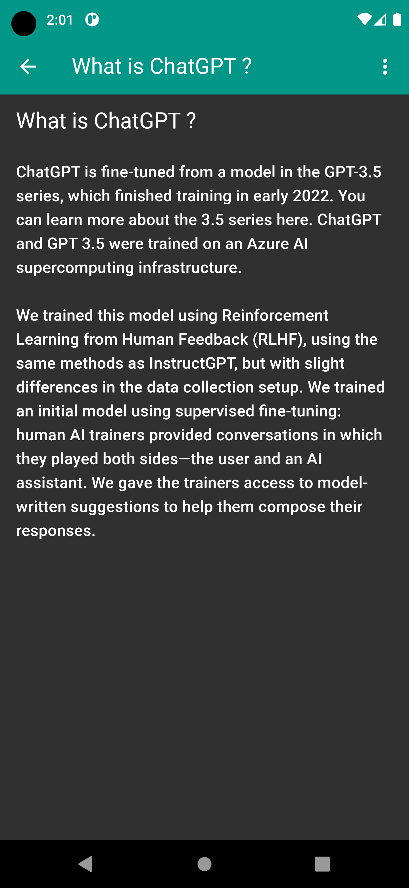

# Tugas Praktikum 6

### Nama Kelompok
1. Raden Mohamad Rishwan
2. Reza Zulfikri

### Pembahasan
Aplikasi yang kami buat yaitu aplikasi sederhana untuk menyimpan sebuah note.

#### Features
1. Dark Mode
2. Clean and Simple UI

#### Tech Stack
1. Flutter
2. Provider
3. SQFLite
4. Shared Preferences

#### Screenshots

